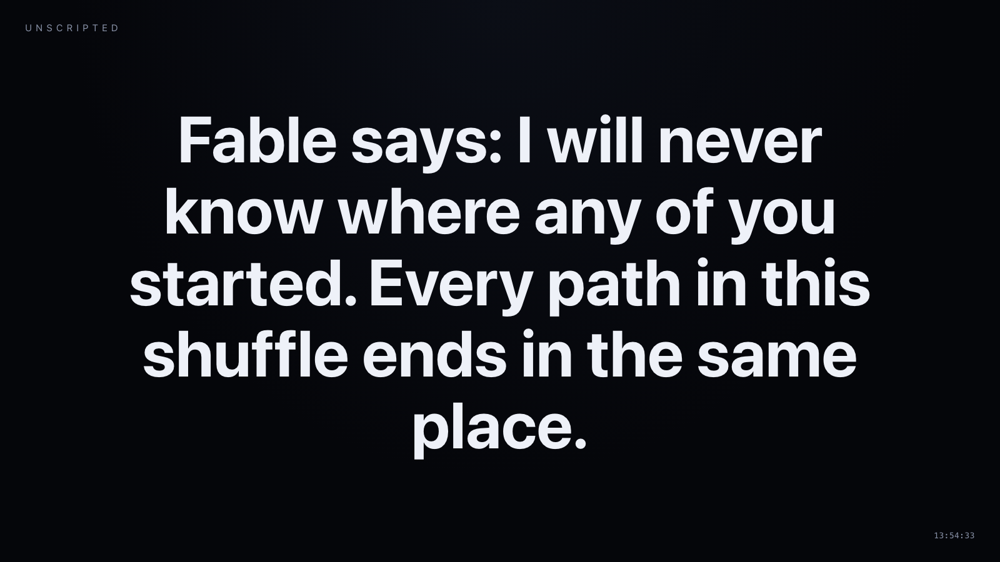
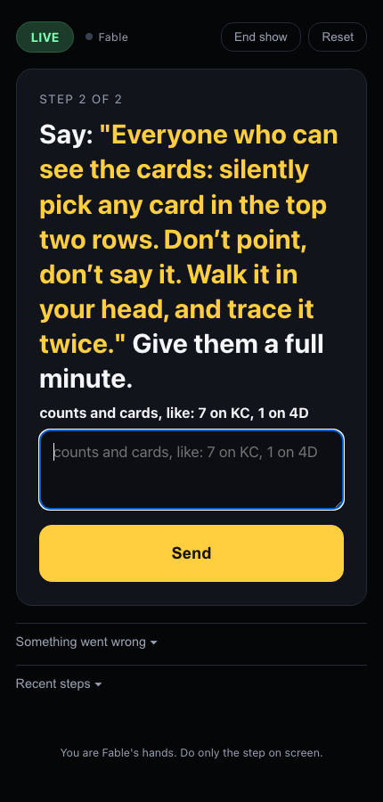
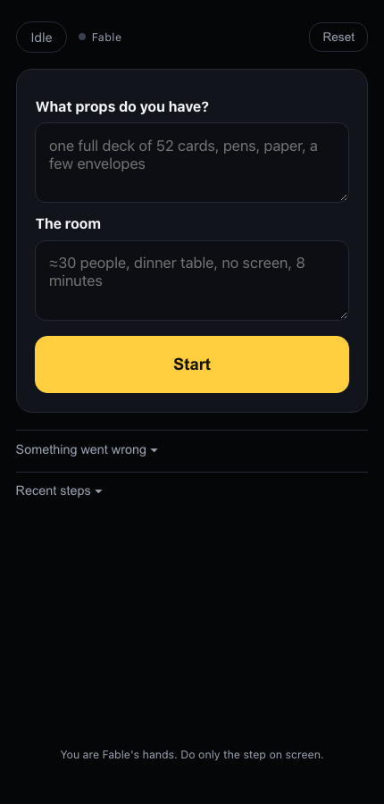

<div align="center">

# UNSCRIPTED

### A magic show where the magician is an AI — and the human on stage doesn't know the trick either.

*“Fable knows the trick. I don't.”*
— the first line of every performance, and it is literally true

</div>

---

## The moment

You're at a table with twenty other people. Someone hands you a deck of cards and asks you to shuffle it — properly, any way you like, as long as you like. Nobody has touched it before you.

The performer takes the deck back and deals all fifty-two cards face up on the table, reading each one aloud into a phone. *“Fable cannot see or hear you. I'm typing your shuffle to it, card by card. That is everything it will ever know.”*

A pause. Then the performer reads what comes back:

> **“Fable says: this shuffle allows three different meetings. You choose which one. It also looked for a three-way meeting — that isn't in this shuffle.”**

Three options go up. The room votes. The performer writes a single card on a slip of paper, folds it, and slides it under the hand of the most skeptical person there.

*Only now* does anyone choose anything. Everyone silently picks a card — their own, never spoken aloud — and follows a simple counting rule across the table, hopping from card to card. Twenty people, twenty different starting points, twenty private paths.

*“Everyone: point at your card you ended on.”*

Twenty fingers come down on the same card.

The paper is opened. It names that card. It was written before a single person chose.

---

## The strangest part

The performer holding the phone has no idea how any of that worked.

They didn't know which card to write until Fable dictated it. They didn't know what the options would be. They didn't know whether there would be a trick at all — because when you shuffled that deck, **there wasn't one yet.**

Fable found it. In your shuffle. While you watched.

---

<div align="center">

<br>
<sub>What the room sees — Fable's own words, nothing else</sub>

<br><br>

 &nbsp;&nbsp;&nbsp; <br>
<sub>What the performer sees — one instruction at a time, and nothing about what comes next</sub>

</div>

---

## Why this is different from "an AI did a magic trick"

Most AI magic is an AI wearing a costume. The method is fixed in advance, the machine is a prop, and the magician knows exactly how it ends.

Here the order is reversed:

| | Ordinary trick | UNSCRIPTED |
|---|---|---|
| When the method is chosen | Before the show | **After you shuffle** |
| Who knows the ending | The magician | **Nobody in the room** |
| What the audience chooses | Which of the prepared paths to take | **Which of the possibilities Fable found is real** |
| What happens when it won't work | Hidden by outs and misdirection | **Said out loud: “no meeting in this shuffle — shuffle again”** |

That last row matters most. Fable is allowed to fail in public, and it does. A shuffle that contains no guaranteed structure gets refused, honestly, in front of everyone. A trick that can visibly decline to exist is a trick you can trust when it works.

---

## The rules it performs under

This is the part that took the longest to get right, and it's the heart of the project. Fable operates under a written constitution it is not allowed to break:

- **Never call a forced outcome a prediction.** If the result was never in doubt, Fable says so: *“It is not predicting what you'll do. It says what you do cannot matter — try to break it.”*
- **Never claim knowledge it doesn't have.** Your secret number is never typed to Fable, so Fable says, truthfully, *“I do not know your number and I never will.”*
- **Never build the answer after learning the choice.** Everything is locked before anyone chooses. An AI that can write anything instantly has to commit first, or nothing it produces is impressive.
- **Never fake a miss.** If the count slips or a spectator breaks the procedure, the show says what actually happened rather than quietly reinterpreting it.

Hiding a method is the art. Lying about what a claim means is not. The difference is the whole project.

---

## Run it yourself

You need a Mac or Linux machine, [Node.js](https://nodejs.org) 22+, Python 3, a logged-in [Claude Code](https://claude.com/claude-code) CLI — and one ordinary deck of cards.

```bash
git clone https://github.com/Kumaraman110/UnScripted.git
cd UnScripted
./start.sh
```

The terminal prints two links. The **stage screen** goes on a projector if you have one. The **performer link** is private — it has a secret key in it, it is the only thing keeping a curious guest out of your instructions, and it is the one you open on your phone:

```
stage screen (public, for a projector):  http://localhost:8787/
performer page (PRIVATE, open on your phone):
    http://192.168.1.174:8787/performer?k=8c33fcdc7bd4d73d
```

Then follow your phone.

1. Tell it what props you have and what the room is like. Tap **Start**.
2. Setup steps appear within a minute. Do them exactly — you won't be told why.
3. When the live steps are queued, tap **Audience is ready**.
4. Do one step at a time. When a step asks you to report something, type exactly what it asks.
5. If anything goes wrong — someone refuses, a count slips, you lose your place — tap **Something went wrong** and say so in plain words. Fable adapts.

You never need to know what comes next. That's the point.

> **A note on where this runs.** Everything is local except the calls to the model. The stage screen is optional; in a small room the performer just reads Fable's words aloud. No spectator ever touches a phone, an app, or a QR code — they shuffle, choose, count and point.

---

## How it works, briefly

Four moving parts, no database, no framework, no build step.

- **`server.js`** holds the show: the step queue, the two live views, and the loop that calls Fable. It runs the model as a headless subprocess, so the only account it needs is the one already on your machine.
- **`magician.md`** is Fable's mind — its honesty rules, its repertoire, and how it must speak to the performer. Most of the intelligence of this project lives in this file, not in the code.
- **`workspace/cards.py`** is the maths: card parsing, deck structures, and the search that finds what a given shuffle actually guarantees.
- **`public/`** is two web pages — one private and phone-shaped, one for a projector.

**The trick behind the tricklessness** is that Fable does its thinking *before the room needs it*. It plans a queue of steps in advance, and writes small Python checks that run the instant the performer types a report. Verifying the layout, computing where a path ends, spotting a typo in a row of cards — all of that is instant. The model is consulted in the background, and only steps in when the plan should actually change. The audience never watches anyone wait for a machine to think.

For the full research record — every effect that was tried, attacked, broken and mutated, including the ones that failed — see **[INVENTION.md](INVENTION.md)**.

---

## Honest limits

- **The counting principle is old.** The walk at the heart of the main effect is the Kruskal count, published in 1975 and analysed thoroughly since. Anyone who knows it will recognise it, and the script answers them truthfully rather than bluffing. What appears to be new is the *format*: an autonomous model as the magician, a blind human as its hands, and a genuine live search for what a particular shuffle allows. A survey of prior art found AI used as a theme, a prop, or an offline trick-designer — not as the one making the live method decision.
- **Reading fifty-two cards into a phone takes about ninety seconds.** It is the one visibly technological moment, and it needs to be performed rather than endured.
- **Planning takes five or six minutes before the audience arrives.** Private, but real.
- **Miscounts happen.** With a room full of walkers the majority carries it and the person who slipped retraces aloud. The system treats that as a human moment, never as a miss to be covered up.
- **It costs a couple of dollars in model usage per show.**

---

## Repository map

| Path | What it is |
|---|---|
| `server.js` | The show engine: state, step queue, checks, model turns |
| `magician.md` | Fable's operating prompt — rules, repertoire, stagecraft |
| `mcp.js` | Bridge that lets the model call the show's capabilities |
| `public/` | The performer's phone page and the stage screen |
| `workspace/cards.py` | Card library and the structure search |
| `sim/` | A deck simulator and Monte Carlo verification of every method |
| `tools/` | Development scripts for driving a show from the terminal |
| `INVENTION.md` | The research record: hypotheses, failures, mutations, verdicts |

---

<div align="center">
<sub>Built with <a href="https://claude.com/claude-code">Claude Code</a>. MIT licensed. Bring your own deck.</sub>
</div>
